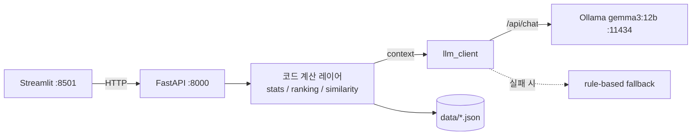

# EDS Impact Review Copilot (데모)

공정 변경점 발생 시 EDS test item의 통계적 변화를 리뷰하는 AI Copilot 데모.
Streamlit + FastAPI + Ollama(gemma3:12b, 사내명 Gemma4 12B).

## 핵심 원칙
- **LLM은 narration/요약만.** 통계·ranking·유사도는 전부 Python 코드가 계산.
- **LLM 응답은 Pydantic schema 강제**(파싱 실패 시 1회 재시도 → rule-based fallback).
- 모든 데이터는 seed 고정 합성 mock. **LLM 미가동 시에도 전체 플로우 동작.**

## 아키텍처



## 프로젝트 구조

```
copilot_demo/
├── backend/
│   ├── constants.py     # 공유 상수 (그룹/가중치/임계값/Ollama 설정/체크리스트)
│   ├── models.py        # Pydantic schemas
│   ├── mock_data.py     # 결정론적 합성 데이터 생성 → data/*.json
│   ├── data_store.py    # data/ JSON 로딩 + 캐시
│   ├── stats_summary.py # overview 통계요약 + before/after 히스토그램
│   ├── ranking.py       # ranking 로딩 (외부 시스템 연동 지점)
│   ├── similarity.py    # 유사 변경점 검색 (2단계 + 가중치 breakdown)
│   ├── prompts.py       # LLM prompt templates
│   ├── llm_client.py    # Ollama wrapper + 재시도 + fallback
│   └── main.py          # FastAPI 엔드포인트
├── frontend/app.py      # Streamlit 3-tab UI
├── data/                # 생성된 json + feedback.jsonl
└── tests/               # pytest
```

## 실행 순서

```bash
# 0) 가상환경
cd copilot_demo
python3 -m venv .venv && source .venv/bin/activate
pip install -r requirements.txt
# (Python 3.14에서 특정 패키지 wheel 문제가 있으면 python3.12 -m venv .venv 로 재생성)

# 1) mock 데이터 생성 (최초 1회 — 서버가 없으면 기동 시 자동 생성도 됨)
python -m backend.mock_data

# 2) LLM (선택 — 없어도 fallback으로 동작)
ollama pull gemma3:12b
ollama serve

# 3) 백엔드
uvicorn backend.main:app --port 8000

# 4) 프론트 (새 터미널, venv 활성화)
streamlit run frontend/app.py
```

브라우저에서 `http://localhost:8501` 접속 → 사이드바에서 변경점 선택 → 3개 탭 사용.

Tab3의 **Copilot 추천 → 승인**: "추천 불러오기" 후 "전체 추천 적용"(일괄) 또는 항목별
"적용" 버튼으로, group 태그·최종 판정·체크리스트를 사용자가 하나씩 고르지 않고 승인만으로
폼에 채웁니다. 추천값은 ranking·signal·유사사례에서 코드로 산출됩니다(LLM 미개입).

### (선택) 로컬 확인용 통합 실행
빈 포트에 백엔드를 자동으로 띄우고 Streamlit(8557)에 연결하는 헬퍼 스크립트:
```bash
bash copilot_demo/scripts/preview_run.sh
```

## 테스트

```bash
python -m pytest -q
```

## 데이터 개요 (합성 mock)
- 변경점 15건 (과거 12 + 현재 3)
- EDS item 200개 (8 group: WL, Cell_Edge, Peripheral, Contact, Metal, Vth, Leakage, Speed)
- 통계 결과 15×200 (각 change당 2~3 group에 일관 shift, q-value는 BH 보정)
- ranking 15×8 group (사전계산 로딩), 과거 리뷰 카드 12건

## 실제 시스템 전환 시 교체 지점

| 데모 | 실 시스템 |
|---|---|
| mock 데이터 (`mock_data.py`, `data/*.json`) | 실 DB |
| ranking 사전계산 로딩 (`ranking.py` 외부 연동 지점 주석) | 실 분석 로직 API |
| 텍스트 TF-IDF (`similarity.text_similarity`) | embedding 모델 |
| 피드백 `data/feedback.jsonl` | feedback DB |
| Streamlit 프론트 | Vue |
