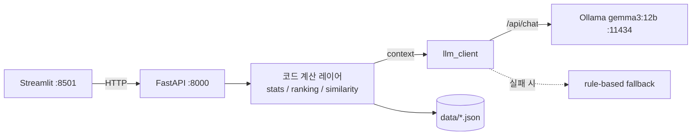

# EDS Impact Review Copilot Implementation Plan

> **For agentic workers:** REQUIRED SUB-SKILL: Use superpowers:subagent-driven-development (recommended) or superpowers:executing-plans to implement this plan task-by-task. Steps use checkbox (`- [ ]`) syntax for tracking.

**Goal:** 공정 변경점 발생 시 EDS test item의 통계적 변화를 리뷰하는 AI Copilot 데모(Streamlit + FastAPI + Ollama gemma3:12b)를 합성 mock 데이터만으로 완결 동작하도록 구축한다.

**Architecture:** Streamlit(:8501) → FastAPI(:8000) → 코드 계산 레이어(stats/ranking/similarity) → 컨텍스트를 Ollama(gemma3:12b)에 전달해 narration JSON만 생성. LLM 실패 시 동일 schema의 rule-based fallback으로 전체 플로우 유지. 모든 데이터는 seed 고정 합성 mock.

**Tech Stack:** Python 3.14 (venv), FastAPI, uvicorn, Pydantic v2, Streamlit, plotly, pandas, numpy, scikit-learn(char n-gram TF-IDF), requests/httpx, pytest.

## Global Constraints

- **LLM은 narration/요약만.** 통계값·ranking·유사도는 전부 Python에서 계산; LLM엔 계산된 컨텍스트만 전달. LLM이 숫자 생성·영향 판정하는 구조 금지.
- **LLM 응답은 Pydantic schema 강제** (Ollama `format=json` + schema). 파싱/검증 실패 시 **1회 재시도** 후 **rule-based fallback**.
- **모든 데이터 합성 mock, 결정론적**: `random.seed(42)` + `numpy.random.default_rng(42)`.
- **데이터 저장: JSON** (`data/*.json`). pyarrow 사용 금지.
- **현재/과거 구분: 12 past + 3 current.** 리뷰카드는 past 12건.
- Ollama: `http://localhost:11434/api/chat`, model `gemma3:12b`, `temperature=0.2`, `timeout=60s`.
- copilot_summary System prompt 명시: "제공된 데이터에 없는 수치나 판정을 생성하지 말 것. 공정 영향 여부를 단정하지 말 것. 모든 주장에 근거 데이터 항목을 언급할 것. 한국어로 답변."
- 8 item groups (고정 순서): `WL, Cell_Edge, Peripheral, Contact, Metal, Vth, Leakage, Speed`.
- similarity 가중치 상수: `W_TREE=0.40, W_SIGNATURE=0.35, W_TYPE=0.15, W_TEXT=0.10`.
- 유의(significant) 판정 임계: `q_value < 0.1`.
- 모든 코드/주석/문구는 스펙 언어(한국어 서술 + 영어 식별자) 유지.

---

## File Structure

```
copilot_demo/
├── backend/
│   ├── __init__.py
│   ├── constants.py         # 공유 상수(그룹, 가중치, 임계값, Ollama 설정)
│   ├── models.py            # Pydantic schemas
│   ├── mock_data.py         # 결정론적 합성 데이터 생성 → data/*.json
│   ├── data_store.py        # data/ JSON 로딩 + 인메모리 캐시 접근자
│   ├── stats_summary.py     # overview 통계요약 + before/after 히스토그램
│   ├── ranking.py           # ranking 로딩 (외부 시스템 연동 지점 주석)
│   ├── similarity.py        # 유사 변경점 검색 (2단계 + 가중치)
│   ├── prompts.py           # system/user prompt templates
│   ├── llm_client.py        # Ollama wrapper + 재시도 + fallback
│   └── main.py              # FastAPI 앱 + 엔드포인트
├── frontend/
│   └── app.py               # Streamlit 3-tab UI
├── data/                    # 생성된 json + feedback.jsonl
├── tests/
│   ├── __init__.py
│   ├── test_mock_data.py
│   ├── test_data_store.py
│   ├── test_stats_summary.py
│   ├── test_similarity.py
│   ├── test_llm_client.py
│   └── test_api.py
├── requirements.txt
└── README.md
```

모든 명령은 프로젝트 루트 `copilot_demo/`에서 실행하며 venv가 활성화된 상태를 가정한다.

---

### Task 0: 프로젝트 스캐폴딩 & 의존성

**Files:**
- Create: `copilot_demo/backend/__init__.py` (빈 파일)
- Create: `copilot_demo/tests/__init__.py` (빈 파일)
- Create: `copilot_demo/requirements.txt`
- Create: `copilot_demo/data/.gitkeep` (빈 파일)

**Interfaces:**
- Produces: 설치된 venv, import 가능한 `backend` 패키지.

- [ ] **Step 1: 디렉토리와 빈 파일 생성**

```bash
cd /Users/chung/Desktop/code/projects/ax_copilot
mkdir -p copilot_demo/backend copilot_demo/frontend copilot_demo/data copilot_demo/tests
touch copilot_demo/backend/__init__.py copilot_demo/tests/__init__.py copilot_demo/data/.gitkeep
```

- [ ] **Step 2: requirements.txt 작성**

`copilot_demo/requirements.txt`:
```
fastapi>=0.115
uvicorn[standard]>=0.34
streamlit>=1.40
plotly>=5.24
pandas>=2.2
numpy>=2.1
scikit-learn>=1.5
pydantic>=2.9
requests>=2.32
httpx>=0.27
pytest>=8.3
```

- [ ] **Step 3: venv 생성 및 설치**

```bash
cd /Users/chung/Desktop/code/projects/ax_copilot/copilot_demo
python3 -m venv .venv
source .venv/bin/activate
pip install --upgrade pip
pip install -r requirements.txt
```
Expected: 설치 성공. 만약 Python 3.14 wheel 부재로 실패하는 패키지가 있으면 `python3.12 -m venv .venv`로 재생성(README에 병기). 설치 후 `python -c "import fastapi, streamlit, plotly, pandas, numpy, sklearn, pydantic; print('ok')"` → `ok`.

- [ ] **Step 4: Commit**

```bash
cd /Users/chung/Desktop/code/projects/ax_copilot
git init 2>/dev/null; git add copilot_demo/backend copilot_demo/tests copilot_demo/requirements.txt copilot_demo/data/.gitkeep
git commit -m "chore: scaffold copilot_demo project and dependencies"
```

---

### Task 1: 공유 상수 (`constants.py`)

**Files:**
- Create: `copilot_demo/backend/constants.py`

**Interfaces:**
- Produces: `ITEM_GROUPS: list[str]`, `PROCESS_MODULES: list[str]`, `CHANGE_TYPES: list[str]`, `FINAL_DECISIONS: list[str]`, `FEEDBACK_TAGS: list[str]`, `SIGNIFICANCE_Q: float`, `W_TREE/W_SIGNATURE/W_TYPE/W_TEXT: float`, `OLLAMA_URL/OLLAMA_MODEL/OLLAMA_TEMPERATURE/OLLAMA_TIMEOUT`, `DATA_DIR: pathlib.Path`, `SEED: int`, `CHECKLIST: list[dict]`.

- [ ] **Step 1: constants.py 작성**

`copilot_demo/backend/constants.py`:
```python
from pathlib import Path

SEED = 42

ITEM_GROUPS = ["WL", "Cell_Edge", "Peripheral", "Contact", "Metal", "Vth", "Leakage", "Speed"]
PROCESS_LEVEL1 = ["FE", "BE"]
PROCESS_MODULES = ["CVD", "Etch", "Photo", "Implant", "CMP", "Diffusion", "Metal"]
PROCESS_LAYERS = ["GateOx", "STI", "BitLine", "WordLine", "Contact", "M1", "M2", "Poly"]
CHANGE_TYPES = ["recipe_param", "hardware", "material", "route"]
FINAL_DECISIONS = ["공정영향", "설비영향", "Noise", "재검토"]
FEEDBACK_TAGS = ["중요", "Noise", "설비의심", "mix의심", "공정가능", "follow-up"]

SIGNIFICANCE_Q = 0.1

W_TREE = 0.40
W_SIGNATURE = 0.35
W_TYPE = 0.15
W_TEXT = 0.10

OLLAMA_URL = "http://localhost:11434/api/chat"
OLLAMA_MODEL = "gemma3:12b"
OLLAMA_TEMPERATURE = 0.2
OLLAMA_TIMEOUT = 60

DATA_DIR = Path(__file__).resolve().parent.parent / "data"

# 정적 표준 체크리스트 (물량/통계/공정/최종 4섹션)
CHECKLIST = [
    {"section": "물량", "items": [
        "변경 적용 lot 수가 통계 판단에 충분한가",
        "before/after 기간의 물량 균형을 확인했는가",
    ]},
    {"section": "통계", "items": [
        "q_value < 0.1 유의 item을 모두 검토했는가",
        "effect_size가 실질적으로 유의미한 수준인가",
        "shift 방향이 물리적으로 설명 가능한가",
    ]},
    {"section": "공정", "items": [
        "변경 내용과 영향 group의 구조적 연관성을 확인했는가",
        "confounding(동시 변경/설비 편차)을 검토했는가",
        "유사 과거 사례의 결론과 비교했는가",
    ]},
    {"section": "최종", "items": [
        "최종 판정 근거를 데이터 항목으로 명시했는가",
        "follow-up action을 정의했는가",
    ]},
]
```

- [ ] **Step 2: import 확인**

Run:
```bash
cd copilot_demo && source .venv/bin/activate
python -c "from backend import constants as c; assert len(c.ITEM_GROUPS)==8 and abs(c.W_TREE+c.W_SIGNATURE+c.W_TYPE+c.W_TEXT-1.0)<1e-9; print('ok')"
```
Expected: `ok`

- [ ] **Step 3: Commit**

```bash
git add copilot_demo/backend/constants.py
git commit -m "feat: add shared constants (groups, weights, ollama config, checklist)"
```

---

### Task 2: Pydantic 스키마 (`models.py`)

**Files:**
- Create: `copilot_demo/backend/models.py`

**Interfaces:**
- Produces (data models): `ProcessStep`, `Change`, `EDSItem`, `StatResult`, `RankingRow`, `RankingFactors`, `AffectedGroup`, `ReviewCard`.
- Produces (API/LLM models): `OverviewResponse`, `GroupImpact`, `SimilarCase`, `SimilarBreakdown`, `SimilarResponse`, `PriorityGroup`, `SimilarCaseInsight`, `CopilotSummary`, `ChecklistSection`, `ChecklistResponse`, `GroupFeedback`, `FeedbackRequest`, `ReportDraftResponse`.

- [ ] **Step 1: 테스트 작성**

`copilot_demo/tests/test_models.py`:
```python
from backend.models import Change, ProcessStep, CopilotSummary, StatResult


def test_change_roundtrip():
    c = Change(
        change_id="CHG-2024-001",
        process_step=ProcessStep(level1="FE", level2="CVD", level3="GateOx", path="FE/CVD/GateOx"),
        change_type="recipe_param", change_direction="증착온도 +5%",
        description_ko="증착 온도를 5% 상향 조정하였다.",
        period_start="2024-03-01", period_end="2024-03-20", lot_count=40, status="current",
    )
    assert c.model_dump()["process_step"]["path"] == "FE/CVD/GateOx"


def test_copilot_summary_schema_has_required_keys():
    schema = CopilotSummary.model_json_schema()
    for k in ["overview_summary", "priority_groups", "confounding_warnings",
              "similar_case_insights", "suggested_checks"]:
        assert k in schema["properties"]


def test_statresult_optional_hist():
    s = StatResult(change_id="CHG-2024-001", item_id="EDS_001", item_group="WL",
                   p_value=0.001, q_value=0.01, effect_size=0.8, shift_direction="up")
    assert s.mean_before is None
```

- [ ] **Step 2: 테스트 실패 확인**

Run: `python -m pytest tests/test_models.py -q`
Expected: FAIL (ModuleNotFoundError: backend.models)

- [ ] **Step 3: models.py 구현**

`copilot_demo/backend/models.py`:
```python
from typing import Literal, Optional
from pydantic import BaseModel, Field


# ---------- 데이터 모델 ----------
class ProcessStep(BaseModel):
    level1: str
    level2: str
    level3: str
    path: str


class Change(BaseModel):
    change_id: str
    process_step: ProcessStep
    change_type: str
    change_direction: str
    description_ko: str
    period_start: str
    period_end: str
    lot_count: int
    status: Literal["past", "current"]


class EDSItem(BaseModel):
    item_id: str
    item_group: str
    struct_location: str
    related_bin: str
    baseline_mean: float
    baseline_std: float
    unit: str


class StatResult(BaseModel):
    change_id: str
    item_id: str
    item_group: str
    p_value: float
    q_value: float
    effect_size: float
    shift_direction: Literal["up", "down", "none"]
    is_representative: bool = False
    mean_before: Optional[float] = None
    std_before: Optional[float] = None
    mean_after: Optional[float] = None
    std_after: Optional[float] = None
    n_hist: Optional[int] = None


class RankingFactors(BaseModel):
    stat_significance: float
    effect_magnitude: float
    coverage: float
    historical_recurrence: float


class RankingRow(BaseModel):
    change_id: str
    group: str
    risk_score: float
    risk_level: Literal["High", "Med", "Low"]
    representative_item: str
    factors: RankingFactors


class AffectedGroup(BaseModel):
    group: str
    direction: Literal["up", "down"]


class ReviewCard(BaseModel):
    change_id: str
    final_decision: str
    affected_groups: list[AffectedGroup]
    confounding_review: str
    follow_up_actions: list[str]
    engineer_comment: str
    reviewer: str
    date: str


# ---------- API 응답 모델 ----------
class GroupImpact(BaseModel):
    group: str
    direction: Literal["up", "down"]
    significant_item_count: int


class OverviewResponse(BaseModel):
    change: Change
    total_items_tested: int
    significant_item_count: int
    affected_groups: list[GroupImpact]


class SimilarBreakdown(BaseModel):
    tree: float
    signature: float
    type: float
    text: float


class SimilarCase(BaseModel):
    change_id: str
    description_ko: str
    change_type: str
    process_path: str
    final_decision: str
    total_score: float
    breakdown: SimilarBreakdown


class SimilarResponse(BaseModel):
    candidates: list[SimilarCase]


class ChecklistSection(BaseModel):
    section: str
    items: list[str]


class ChecklistResponse(BaseModel):
    sections: list[ChecklistSection]


# ---------- LLM 출력 모델 ----------
class PriorityGroup(BaseModel):
    group: str
    reason: str


class SimilarCaseInsight(BaseModel):
    change_id: str
    relevance: str


class CopilotSummary(BaseModel):
    overview_summary: str = Field(..., description="한국어 3~4문장")
    priority_groups: list[PriorityGroup]
    confounding_warnings: list[str]
    similar_case_insights: list[SimilarCaseInsight]
    suggested_checks: list[str]


# ---------- 피드백/보고서 ----------
class GroupFeedback(BaseModel):
    group: str
    tags: list[str]


class FeedbackRequest(BaseModel):
    checklist_state: dict[str, bool] = {}
    group_feedback: list[GroupFeedback] = []
    final_decision: Optional[str] = None
    comment: str = ""


class ReportDraftResponse(BaseModel):
    markdown: str
    used_llm: bool
```

- [ ] **Step 4: 테스트 통과 확인**

Run: `python -m pytest tests/test_models.py -q`
Expected: PASS (3 passed)

- [ ] **Step 5: Commit**

```bash
git add copilot_demo/backend/models.py copilot_demo/tests/test_models.py
git commit -m "feat: add pydantic schemas for data, api, and llm output"
```

---

### Task 3: 결정론적 Mock 데이터 생성 (`mock_data.py`)

**Files:**
- Create: `copilot_demo/backend/mock_data.py`
- Create: `copilot_demo/tests/test_mock_data.py`

**Interfaces:**
- Consumes: `constants`, `models`.
- Produces: `generate_all() -> None` (data/*.json 기록), 헬퍼 `benjamini_hochberg(pvals: list[float]) -> list[float]`. 생성 파일: `changes.json, eds_items.json, stats.json, ranking.json, review_cards.json`.

- [ ] **Step 1: 테스트 작성**

`copilot_demo/tests/test_mock_data.py`:
```python
import json
from backend import mock_data
from backend.constants import DATA_DIR, ITEM_GROUPS


def _load(name):
    return json.loads((DATA_DIR / name).read_text(encoding="utf-8"))


def test_generate_is_deterministic_and_counts():
    mock_data.generate_all()
    changes = _load("changes.json")
    items = _load("eds_items.json")
    stats = _load("stats.json")
    ranking = _load("ranking.json")
    cards = _load("review_cards.json")

    assert len(changes) == 15
    assert sum(c["status"] == "past" for c in changes) == 12
    assert sum(c["status"] == "current" for c in changes) == 3
    assert len(items) == 200
    assert {i["item_group"] for i in items} <= set(ITEM_GROUPS)
    assert len(stats) == 15 * 200
    assert len(ranking) == 15 * 8
    assert len(cards) == 12

    # 결정론성: 재생성해도 동일
    first = (DATA_DIR / "stats.json").read_text(encoding="utf-8")
    mock_data.generate_all()
    assert (DATA_DIR / "stats.json").read_text(encoding="utf-8") == first


def test_signal_structure_present():
    mock_data.generate_all()
    stats = _load("stats.json")
    # 각 change에 유의(q<0.1) item이 존재하고, 2~3개 group에 집중
    by_change = {}
    for s in stats:
        by_change.setdefault(s["change_id"], []).append(s)
    for cid, rows in by_change.items():
        sig = [r for r in rows if r["q_value"] < 0.1]
        assert len(sig) > 0
        sig_groups = {r["item_group"] for r in sig}
        assert 1 <= len(sig_groups) <= 4


def test_bh_monotonic():
    q = mock_data.benjamini_hochberg([0.001, 0.02, 0.5, 0.9])
    assert all(0.0 <= x <= 1.0 for x in q)
    assert q[0] <= q[-1]
```

- [ ] **Step 2: 테스트 실패 확인**

Run: `python -m pytest tests/test_mock_data.py -q`
Expected: FAIL (ModuleNotFoundError / AttributeError)

- [ ] **Step 3: mock_data.py 구현**

`copilot_demo/backend/mock_data.py`:
```python
"""결정론적 합성 mock 데이터 생성. 실행: python -m backend.mock_data"""
import json
import random
import numpy as np

from backend.constants import (
    DATA_DIR, SEED, ITEM_GROUPS, PROCESS_LEVEL1, PROCESS_MODULES, PROCESS_LAYERS,
    CHANGE_TYPES, FINAL_DECISIONS,
)

N_CHANGES = 15
N_ITEMS = 200
N_PAST = 12

_CHANGE_TEMPLATES = [
    ("증착온도 +5%", "recipe_param", "CVD 챔버 증착 온도를 5% 상향 조정하였다."),
    ("가스 유량 감소", "recipe_param", "반응 가스 유량을 8% 감소시켜 두께 균일도를 개선하였다."),
    ("타겟 소재 교체", "material", "메탈 증착 타겟을 신규 벤더 소재로 교체하였다."),
    ("세정 스텝 추가", "route", "식각 전 추가 세정 스텝을 라우트에 삽입하였다."),
    ("챔버 하드웨어 교체", "hardware", "노후 챔버의 샤워헤드를 신규 부품으로 교체하였다."),
    ("이온주입 도즈 상향", "recipe_param", "이온주입 도즈를 3% 상향하여 문턱전압을 조정하였다."),
    ("CMP 압력 변경", "recipe_param", "CMP 연마 압력을 재설정하여 평탄도를 조정하였다."),
    ("포토 노광량 조정", "recipe_param", "노광 에너지를 미세 조정하여 CD를 보정하였다."),
    ("슬러리 벤더 변경", "material", "CMP 슬러리 공급 벤더를 변경하였다."),
    ("확산 시간 단축", "recipe_param", "확산 공정 시간을 단축하여 열예산을 줄였다."),
    ("식각 레시피 변경", "recipe_param", "식각 종료점 검출 조건을 변경하였다."),
    ("배선 라우트 변경", "route", "M1 배선 경로를 재설계하여 저항을 낮추었다."),
    ("설비 이관", "hardware", "동일 공정을 신규 설비로 이관하였다."),
    ("전구체 교체", "material", "증착 전구체를 신규 물질로 교체하였다."),
    ("어닐 온도 변경", "recipe_param", "후속 어닐 온도를 조정하였다."),
]


def benjamini_hochberg(pvals):
    """BH FDR 보정. 입력 순서를 유지한 q-value 리스트 반환."""
    n = len(pvals)
    order = sorted(range(n), key=lambda i: pvals[i])
    q = [0.0] * n
    prev = 1.0
    for rank in range(n - 1, -1, -1):
        i = order[rank]
        val = pvals[i] * n / (rank + 1)
        prev = min(prev, val)
        q[i] = min(1.0, prev)
    return q


def _make_changes(rng):
    changes = []
    for k in range(N_CHANGES):
        tmpl = _CHANGE_TEMPLATES[k]
        level1 = PROCESS_LEVEL1[k % len(PROCESS_LEVEL1)]
        level2 = PROCESS_MODULES[k % len(PROCESS_MODULES)]
        level3 = PROCESS_LAYERS[k % len(PROCESS_LAYERS)]
        status = "past" if k < N_PAST else "current"
        month = (k % 10) + 1
        changes.append({
            "change_id": f"CHG-2024-{k+1:03d}",
            "process_step": {
                "level1": level1, "level2": level2, "level3": level3,
                "path": f"{level1}/{level2}/{level3}",
            },
            "change_type": tmpl[1],
            "change_direction": tmpl[0],
            "description_ko": tmpl[2],
            "period_start": f"2024-{month:02d}-01",
            "period_end": f"2024-{month:02d}-20",
            "lot_count": int(rng.integers(20, 61)),
            "status": status,
        })
    return changes


def _make_items(rng):
    items = []
    for i in range(N_ITEMS):
        group = ITEM_GROUPS[i % len(ITEM_GROUPS)]
        items.append({
            "item_id": f"EDS_{i+1:03d}",
            "item_group": group,
            "struct_location": f"{group}_loc_{i % 7}",
            "related_bin": f"BIN{(i % 9) + 1}",
            "baseline_mean": round(float(rng.uniform(0.5, 5.0)), 3),
            "baseline_std": round(float(rng.uniform(0.05, 0.3)), 3),
            "unit": "a.u.",
        })
    return items


def _make_stats_and_ranking(rng, changes, items):
    stats, ranking = [], []
    items_by_group = {g: [it for it in items if it["item_group"] == g] for g in ITEM_GROUPS}

    for c in changes:
        cid = c["change_id"]
        n_signal = int(rng.integers(2, 4))  # 2~3개 group
        signal_groups = list(rng.choice(ITEM_GROUPS, size=n_signal, replace=False))
        signal_dir = {g: ("up" if rng.random() < 0.5 else "down") for g in signal_groups}

        rows, pvals = [], []
        for it in items:
            g = it["item_group"]
            if g in signal_groups:
                mag = float(rng.uniform(0.4, 1.2))
                effect = mag if signal_dir[g] == "up" else -mag
                p = float(rng.uniform(1e-5, 0.02))
                direction = signal_dir[g]
            else:
                effect = float(rng.normal(0.0, 0.1))
                p = float(rng.uniform(0.05, 1.0))
                direction = "none"
            rows.append({"item": it, "effect": effect, "p": p, "direction": direction})
            pvals.append(p)

        qvals = benjamini_hochberg(pvals)

        # 각 group의 대표 item = |effect| 최대
        rep_by_group = {}
        for r, q in zip(rows, qvals):
            g = r["item"]["item_group"]
            if g not in rep_by_group or abs(r["effect"]) > abs(rep_by_group[g]["effect"]):
                rep_by_group[g] = {**r, "q": q}

        for r, q in zip(rows, qvals):
            it = r["item"]
            g = it["item_group"]
            is_rep = rep_by_group[g]["item"]["item_id"] == it["item_id"]
            entry = {
                "change_id": cid, "item_id": it["item_id"], "item_group": g,
                "p_value": round(r["p"], 6), "q_value": round(q, 6),
                "effect_size": round(r["effect"], 4), "shift_direction": r["direction"],
                "is_representative": is_rep,
            }
            if is_rep:
                base = it["baseline_mean"]
                std = it["baseline_std"]
                shift = r["effect"] * std * 2.0
                entry.update({
                    "mean_before": round(base, 4),
                    "std_before": round(std, 4),
                    "mean_after": round(base + shift, 4),
                    "std_after": round(std, 4),
                    "n_hist": 200,
                })
            stats.append(entry)

        # ranking: 8개 group 전부
        for g in ITEM_GROUPS:
            grp_rows = [r for r in rows if r["item"]["item_group"] == g]
            grp_q = [q for r, q in zip(rows, qvals) if r["item"]["item_group"] == g]
            sig_ratio = sum(q < 0.1 for q in grp_q) / max(1, len(grp_q))
            max_eff = max(abs(r["effect"]) for r in grp_rows)
            stat_sig = min(1.0, sum(1 for q in grp_q if q < 0.1) / 3.0)
            eff_mag = min(1.0, max_eff / 1.2)
            coverage = sig_ratio
            hist_rec = float(rng.uniform(0.0, 0.4)) + (0.4 if g in signal_groups else 0.0)
            hist_rec = min(1.0, hist_rec)
            risk = 0.4 * stat_sig + 0.35 * eff_mag + 0.15 * coverage + 0.10 * hist_rec
            level = "High" if risk >= 0.6 else ("Med" if risk >= 0.35 else "Low")
            ranking.append({
                "change_id": cid, "group": g,
                "risk_score": round(risk, 4), "risk_level": level,
                "representative_item": rep_by_group[g]["item"]["item_id"],
                "factors": {
                    "stat_significance": round(stat_sig, 4),
                    "effect_magnitude": round(eff_mag, 4),
                    "coverage": round(coverage, 4),
                    "historical_recurrence": round(hist_rec, 4),
                },
            })
    return stats, ranking


def _make_review_cards(rng, changes, stats):
    cards = []
    sig_by_change = {}
    for s in stats:
        if s["q_value"] < 0.1:
            sig_by_change.setdefault(s["change_id"], {})
            g = s["item_group"]
            sig_by_change[s["change_id"]][g] = s["shift_direction"]
    reviewers = ["김공정", "이설비", "박수율", "최소자"]
    for c in changes:
        if c["status"] != "past":
            continue
        cid = c["change_id"]
        affected = [{"group": g, "direction": d}
                    for g, d in list(sig_by_change.get(cid, {}).items())[:3]]
        decision = FINAL_DECISIONS[rng.integers(0, len(FINAL_DECISIONS))]
        cards.append({
            "change_id": cid,
            "final_decision": decision,
            "affected_groups": affected,
            "confounding_review": "동시 진행된 설비 PM 이력 및 lot mix 편차를 검토함.",
            "follow_up_actions": ["추가 lot 모니터링", "설비 편차 재확인"],
            "engineer_comment": f"{c['change_direction']} 변경 후 {', '.join(a['group'] for a in affected) or '유의 group 없음'} 관찰됨.",
            "reviewer": reviewers[int(rng.integers(0, len(reviewers)))],
            "date": c["period_end"],
        })
    return cards


def generate_all():
    DATA_DIR.mkdir(parents=True, exist_ok=True)
    random.seed(SEED)
    rng = np.random.default_rng(SEED)
    changes = _make_changes(rng)
    items = _make_items(rng)
    stats, ranking = _make_stats_and_ranking(rng, changes, items)
    cards = _make_review_cards(rng, changes, stats)

    def _write(name, obj):
        (DATA_DIR / name).write_text(
            json.dumps(obj, ensure_ascii=False, indent=2), encoding="utf-8")

    _write("changes.json", changes)
    _write("eds_items.json", items)
    _write("stats.json", stats)
    _write("ranking.json", ranking)
    _write("review_cards.json", cards)


if __name__ == "__main__":
    generate_all()
    print(f"mock data written to {DATA_DIR}")
```

- [ ] **Step 4: 테스트 통과 확인**

Run: `python -m pytest tests/test_mock_data.py -q`
Expected: PASS (3 passed). 실패 시 signal group 수/BH 로직 점검.

- [ ] **Step 5: 데이터 생성 및 Commit**

```bash
python -m backend.mock_data
git add copilot_demo/backend/mock_data.py copilot_demo/tests/test_mock_data.py copilot_demo/data/*.json
git commit -m "feat: deterministic synthetic mock data generation"
```

---

### Task 4: 데이터 로딩 계층 (`data_store.py`)

**Files:**
- Create: `copilot_demo/backend/data_store.py`
- Create: `copilot_demo/tests/test_data_store.py`

**Interfaces:**
- Consumes: `constants`, `mock_data.generate_all` (파일 부재 시 자동 생성).
- Produces: `ensure_data()`, `get_changes() -> list[dict]`, `get_change(cid) -> dict`, `get_items() -> list[dict]`, `get_stats(cid) -> list[dict]`, `get_ranking(cid) -> list[dict]`, `get_review_cards() -> list[dict]`, `get_review_card(cid) -> dict | None`. 모두 dict(원시 JSON) 반환. `reload()` 캐시 초기화.

- [ ] **Step 1: 테스트 작성**

`copilot_demo/tests/test_data_store.py`:
```python
from backend import data_store as ds


def test_getters():
    ds.reload()
    changes = ds.get_changes()
    assert len(changes) == 15
    cid = changes[0]["change_id"]
    assert ds.get_change(cid)["change_id"] == cid
    assert len(ds.get_items()) == 200
    assert len(ds.get_stats(cid)) == 200
    assert len(ds.get_ranking(cid)) == 8
    assert len(ds.get_review_cards()) == 12


def test_review_card_lookup_returns_none_for_current():
    ds.reload()
    current = [c for c in ds.get_changes() if c["status"] == "current"][0]
    assert ds.get_review_card(current["change_id"]) is None
```

- [ ] **Step 2: 테스트 실패 확인**

Run: `python -m pytest tests/test_data_store.py -q`
Expected: FAIL (ModuleNotFoundError)

- [ ] **Step 3: data_store.py 구현**

`copilot_demo/backend/data_store.py`:
```python
"""data/*.json 로딩 + 인메모리 캐시. 파일 부재 시 자동 생성."""
import json

from backend.constants import DATA_DIR
from backend import mock_data

_CACHE = {}
_FILES = ["changes", "eds_items", "stats", "ranking", "review_cards"]


def ensure_data():
    if not (DATA_DIR / "changes.json").exists():
        mock_data.generate_all()


def _load(name):
    if name not in _CACHE:
        ensure_data()
        _CACHE[name] = json.loads((DATA_DIR / f"{name}.json").read_text(encoding="utf-8"))
    return _CACHE[name]


def reload():
    _CACHE.clear()


def get_changes():
    return _load("changes")


def get_change(cid):
    for c in get_changes():
        if c["change_id"] == cid:
            return c
    return None


def get_items():
    return _load("eds_items")


def get_stats(cid):
    return [s for s in _load("stats") if s["change_id"] == cid]


def get_ranking(cid):
    return [r for r in _load("ranking") if r["change_id"] == cid]


def get_review_cards():
    return _load("review_cards")


def get_review_card(cid):
    for card in get_review_cards():
        if card["change_id"] == cid:
            return card
    return None
```

- [ ] **Step 4: 테스트 통과 확인**

Run: `python -m pytest tests/test_data_store.py -q`
Expected: PASS (2 passed)

- [ ] **Step 5: Commit**

```bash
git add copilot_demo/backend/data_store.py copilot_demo/tests/test_data_store.py
git commit -m "feat: json data store with in-memory cache"
```

---

### Task 5: 통계 요약 & 히스토그램 (`stats_summary.py`)

**Files:**
- Create: `copilot_demo/backend/stats_summary.py`
- Create: `copilot_demo/tests/test_stats_summary.py`

**Interfaces:**
- Consumes: `data_store`, `constants.SIGNIFICANCE_Q`, `models.OverviewResponse/GroupImpact`.
- Produces: `build_overview(cid) -> OverviewResponse`, `significant_signature(cid) -> dict[str, str]` (group→direction, q<0.1), `histogram_samples(cid, item_id) -> dict` (`{"before": [float], "after": [float], "item_id": str}` 결정론적).

- [ ] **Step 1: 테스트 작성**

`copilot_demo/tests/test_stats_summary.py`:
```python
from backend import stats_summary as ss, data_store as ds


def test_overview_counts_significant():
    ds.reload()
    cid = ds.get_changes()[0]["change_id"]
    ov = ss.build_overview(cid)
    assert ov.total_items_tested == 200
    assert ov.significant_item_count >= 0
    assert len(ov.affected_groups) == len({g.group for g in ov.affected_groups})


def test_signature_matches_significant_groups():
    ds.reload()
    cid = ds.get_changes()[0]["change_id"]
    sig = ss.significant_signature(cid)
    assert all(d in ("up", "down") for d in sig.values())


def test_histogram_deterministic():
    ds.reload()
    cid = ds.get_changes()[0]["change_id"]
    rep = [s for s in ds.get_stats(cid) if s["is_representative"]][0]
    h1 = ss.histogram_samples(cid, rep["item_id"])
    h2 = ss.histogram_samples(cid, rep["item_id"])
    assert h1["before"] == h2["before"]
    assert len(h1["after"]) == rep["n_hist"]
```

- [ ] **Step 2: 테스트 실패 확인**

Run: `python -m pytest tests/test_stats_summary.py -q`
Expected: FAIL (ModuleNotFoundError)

- [ ] **Step 3: stats_summary.py 구현**

`copilot_demo/backend/stats_summary.py`:
```python
"""overview 통계 요약 + before/after 히스토그램 (모두 코드 계산)."""
import numpy as np

from backend import data_store as ds
from backend.constants import SIGNIFICANCE_Q, ITEM_GROUPS
from backend.models import OverviewResponse, GroupImpact, Change


def significant_signature(cid):
    """q<0.1 유의 item을 group→dominant direction 으로 요약."""
    sig = {}
    dir_count = {}
    for s in ds.get_stats(cid):
        if s["q_value"] < SIGNIFICANCE_Q and s["shift_direction"] in ("up", "down"):
            g = s["item_group"]
            dir_count.setdefault(g, {"up": 0, "down": 0})
            dir_count[g][s["shift_direction"]] += 1
    for g, dc in dir_count.items():
        sig[g] = "up" if dc["up"] >= dc["down"] else "down"
    return sig


def build_overview(cid):
    change = ds.get_change(cid)
    stats = ds.get_stats(cid)
    sig = [s for s in stats if s["q_value"] < SIGNIFICANCE_Q]
    signature = significant_signature(cid)
    counts = {}
    for s in sig:
        counts[s["item_group"]] = counts.get(s["item_group"], 0) + 1
    affected = [
        GroupImpact(group=g, direction=signature[g], significant_item_count=counts.get(g, 0))
        for g in ITEM_GROUPS if g in signature
    ]
    affected.sort(key=lambda x: x.significant_item_count, reverse=True)
    return OverviewResponse(
        change=Change(**change),
        total_items_tested=len(stats),
        significant_item_count=len(sig),
        affected_groups=affected,
    )


def histogram_samples(cid, item_id):
    stats = ds.get_stats(cid)
    row = next((s for s in stats if s["item_id"] == item_id and s["is_representative"]), None)
    if row is None:
        row = next((s for s in stats if s["item_id"] == item_id), None)
    if row is None or row.get("mean_before") is None:
        # 대표 item이 아니면 baseline으로 대체
        item = next(it for it in ds.get_items() if it["item_id"] == item_id)
        mb = ma = item["baseline_mean"]
        sb = sa = item["baseline_std"]
        n = 200
    else:
        mb, sb = row["mean_before"], row["std_before"]
        ma, sa = row["mean_after"], row["std_after"]
        n = row["n_hist"]
    seed = abs(hash(f"{cid}:{item_id}")) % (2**32)
    rng = np.random.default_rng(seed)
    before = [round(float(x), 4) for x in rng.normal(mb, sb, n)]
    after = [round(float(x), 4) for x in rng.normal(ma, sa, n)]
    return {"item_id": item_id, "before": before, "after": after}
```

- [ ] **Step 4: 테스트 통과 확인**

Run: `python -m pytest tests/test_stats_summary.py -q`
Expected: PASS (3 passed)

- [ ] **Step 5: Commit**

```bash
git add copilot_demo/backend/stats_summary.py copilot_demo/tests/test_stats_summary.py
git commit -m "feat: overview summary and deterministic histogram samples"
```

---

### Task 6: Ranking 로딩 (`ranking.py`)

**Files:**
- Create: `copilot_demo/backend/ranking.py`
- Create: `copilot_demo/tests/test_ranking.py`

**Interfaces:**
- Consumes: `data_store.get_ranking`, `models.RankingRow`.
- Produces: `get_ranking_table(cid) -> list[RankingRow]` (risk_score 내림차순 정렬).

- [ ] **Step 1: 테스트 작성**

`copilot_demo/tests/test_ranking.py`:
```python
from backend import ranking, data_store as ds


def test_ranking_sorted_desc_and_typed():
    ds.reload()
    cid = ds.get_changes()[0]["change_id"]
    table = ranking.get_ranking_table(cid)
    assert len(table) == 8
    scores = [r.risk_score for r in table]
    assert scores == sorted(scores, reverse=True)
    assert all(r.risk_level in ("High", "Med", "Low") for r in table)
```

- [ ] **Step 2: 테스트 실패 확인**

Run: `python -m pytest tests/test_ranking.py -q`
Expected: FAIL (ModuleNotFoundError)

- [ ] **Step 3: ranking.py 구현**

`copilot_demo/backend/ranking.py`:
```python
"""item group risk ranking.

=== 외부 시스템 연동 지점 =====================================================
실제 시스템에서는 기존 분석 로직(사내 통계/ranking 엔진)이 change별 item group
risk score를 제공한다. 이 데모에서는 mock_data가 사전계산해 data/ranking.json 에
기록한 값을 로딩만 한다. 실 전환 시 get_ranking_table() 내부를 사내 API 호출로
교체하면 되며, 반환 스키마(RankingRow)는 그대로 유지한다.
============================================================================
"""
from backend import data_store as ds
from backend.models import RankingRow


def get_ranking_table(cid):
    rows = [RankingRow(**r) for r in ds.get_ranking(cid)]
    rows.sort(key=lambda r: r.risk_score, reverse=True)
    return rows
```

- [ ] **Step 4: 테스트 통과 확인**

Run: `python -m pytest tests/test_ranking.py -q`
Expected: PASS (1 passed)

- [ ] **Step 5: Commit**

```bash
git add copilot_demo/backend/ranking.py copilot_demo/tests/test_ranking.py
git commit -m "feat: ranking table loader with external-system integration note"
```

---

### Task 7: 유사도 엔진 (`similarity.py`)

**Files:**
- Create: `copilot_demo/backend/similarity.py`
- Create: `copilot_demo/tests/test_similarity.py`

**Interfaces:**
- Consumes: `data_store`, `stats_summary.significant_signature`, `constants` 가중치, `models.SimilarCase/SimilarBreakdown/SimilarResponse`.
- Produces: `tree_proximity(a: dict, b: dict) -> float`, `signature_similarity(sig_a: dict, sig_b: dict) -> float`, `text_similarity(text_a, text_b, corpus) -> float`, `find_similar(cid, top_k=3) -> SimilarResponse`.

- [ ] **Step 1: 테스트 작성**

`copilot_demo/tests/test_similarity.py`:
```python
from backend import similarity as sim, data_store as ds


def test_tree_proximity_levels():
    a = {"level1": "FE", "level2": "CVD", "level3": "GateOx"}
    assert sim.tree_proximity(a, a) == 1.0
    assert sim.tree_proximity(a, {"level1": "FE", "level2": "CVD", "level3": "STI"}) == 0.6
    assert sim.tree_proximity(a, {"level1": "FE", "level2": "Etch", "level3": "STI"}) == 0.3
    assert sim.tree_proximity(a, {"level1": "BE", "level2": "Metal", "level3": "M1"}) == 0.0


def test_signature_similarity_direction_bonus():
    base = {"WL": "up", "Vth": "down"}
    same = sim.signature_similarity(base, {"WL": "up", "Vth": "down"})
    opp = sim.signature_similarity(base, {"WL": "down", "Vth": "up"})
    assert same > opp
    assert sim.signature_similarity({}, {}) == 0.0


def test_find_similar_returns_top3_from_past():
    ds.reload()
    current = [c for c in ds.get_changes() if c["status"] == "current"][0]
    resp = sim.find_similar(current["change_id"])
    assert len(resp.candidates) <= 3
    ids = {c.change_id for c in resp.candidates}
    past_ids = {c["change_id"] for c in ds.get_changes() if c["status"] == "past"}
    assert ids <= past_ids
    # breakdown 축 노출 + 정렬
    scores = [c.total_score for c in resp.candidates]
    assert scores == sorted(scores, reverse=True)
    if resp.candidates:
        b = resp.candidates[0].breakdown
        assert 0.0 <= b.tree <= 1.0
```

- [ ] **Step 2: 테스트 실패 확인**

Run: `python -m pytest tests/test_similarity.py -q`
Expected: FAIL (ModuleNotFoundError)

- [ ] **Step 3: similarity.py 구현**

`copilot_demo/backend/similarity.py`:
```python
"""유사 변경점 검색: (1) hard filter (2) 4축 가중합. 설명가능성 위해 breakdown 노출."""
from sklearn.feature_extraction.text import TfidfVectorizer
from sklearn.metrics.pairwise import cosine_similarity

from backend import data_store as ds
from backend.stats_summary import significant_signature
from backend.constants import W_TREE, W_SIGNATURE, W_TYPE, W_TEXT
from backend.models import SimilarCase, SimilarBreakdown, SimilarResponse


def tree_proximity(a, b):
    if a["level1"] == b["level1"] and a["level2"] == b["level2"] and a["level3"] == b["level3"]:
        return 1.0
    if a["level1"] == b["level1"] and a["level2"] == b["level2"]:
        return 0.6
    if a["level1"] == b["level1"]:
        return 0.3
    return 0.0


def signature_similarity(sig_a, sig_b):
    """유의 group set의 Jaccard + 교집합에서 방향 일치 보너스."""
    ga, gb = set(sig_a), set(sig_b)
    if not ga or not gb:
        return 0.0
    inter = ga & gb
    union = ga | gb
    jaccard = len(inter) / len(union)
    if not inter:
        return round(jaccard, 4)
    agree = sum(1 for g in inter if sig_a[g] == sig_b[g]) / len(inter)
    return round(min(1.0, 0.7 * jaccard + 0.3 * jaccard * agree + 0.3 * agree * (len(inter) / len(union))), 4)


def text_similarity(text_a, text_b, corpus):
    vec = TfidfVectorizer(analyzer="char_wb", ngram_range=(2, 3))
    vec.fit(corpus + [text_a, text_b])
    m = vec.transform([text_a, text_b])
    return float(cosine_similarity(m[0], m[1])[0][0])


def _hard_filter(base, cand):
    return (base["process_step"]["level1"] == cand["process_step"]["level1"]
            or base["change_type"] == cand["change_type"])


def find_similar(cid, top_k=3):
    base = ds.get_change(cid)
    base_sig = significant_signature(cid)
    candidates = [c for c in ds.get_changes()
                  if c["status"] == "past" and c["change_id"] != cid]
    corpus = [c["description_ko"] for c in ds.get_changes()]

    scored = []
    for cand in candidates:
        if not _hard_filter(base, cand):
            continue
        tree = tree_proximity(base["process_step"], cand["process_step"])
        sig = signature_similarity(base_sig, significant_signature(cand["change_id"]))
        typ = 1.0 if base["change_type"] == cand["change_type"] else 0.0
        txt = text_similarity(base["description_ko"], cand["description_ko"], corpus)
        total = W_TREE * tree + W_SIGNATURE * sig + W_TYPE * typ + W_TEXT * txt
        card = ds.get_review_card(cand["change_id"])
        scored.append(SimilarCase(
            change_id=cand["change_id"],
            description_ko=cand["description_ko"],
            change_type=cand["change_type"],
            process_path=cand["process_step"]["path"],
            final_decision=card["final_decision"] if card else "N/A",
            total_score=round(total, 4),
            breakdown=SimilarBreakdown(
                tree=round(tree, 4), signature=round(sig, 4),
                type=round(typ, 4), text=round(txt, 4)),
        ))
    scored.sort(key=lambda s: s.total_score, reverse=True)
    return SimilarResponse(candidates=scored[:top_k])
```

- [ ] **Step 4: 테스트 통과 확인**

Run: `python -m pytest tests/test_similarity.py -q`
Expected: PASS (3 passed). 실패 시 tree_proximity 반환값과 hard filter 로직 점검.

- [ ] **Step 5: Commit**

```bash
git add copilot_demo/backend/similarity.py copilot_demo/tests/test_similarity.py
git commit -m "feat: two-stage similarity engine with score breakdown"
```

---

### Task 8: 프롬프트 & LLM 클라이언트 (`prompts.py`, `llm_client.py`)

**Files:**
- Create: `copilot_demo/backend/prompts.py`
- Create: `copilot_demo/backend/llm_client.py`
- Create: `copilot_demo/tests/test_llm_client.py`

**Interfaces:**
- Consumes: `constants`, `models.CopilotSummary`.
- Produces (prompts): `COPILOT_SYSTEM: str`, `build_copilot_user(context: dict) -> str`, `REPORT_SYSTEM: str`, `build_report_user(context: dict) -> str`, `COMMENT_SYSTEM: str`, `build_comment_user(comment: str) -> str`.
- Produces (llm_client): `call_ollama(system, user, schema, timeout) -> dict` (raises on 실패), `generate_copilot_summary(context) -> tuple[CopilotSummary, bool]` (bool=used_llm), `fallback_summary(context) -> CopilotSummary`, `generate_report(context) -> tuple[str, bool]`, `structure_comment(comment) -> dict`.

- [ ] **Step 1: 테스트 작성 (Ollama 호출은 monkeypatch)**

`copilot_demo/tests/test_llm_client.py`:
```python
import json
import pytest
from backend import llm_client as llm
from backend.models import CopilotSummary

CONTEXT = {
    "overview": {"change_id": "CHG-2024-013", "change_direction": "설비 이관",
                 "process_path": "FE/Metal/M1", "significant_item_count": 12,
                 "affected_groups": [{"group": "Metal", "direction": "up", "significant_item_count": 8}]},
    "ranking": [{"group": "Metal", "risk_level": "High", "risk_score": 0.72,
                 "representative_item": "EDS_005"}],
    "similar": [{"change_id": "CHG-2024-003", "final_decision": "공정영향", "total_score": 0.61}],
}


def test_fallback_summary_is_valid_schema():
    s = llm.fallback_summary(CONTEXT)
    assert isinstance(s, CopilotSummary)
    assert "Metal" in " ".join(p.group for p in s.priority_groups)


def test_generate_summary_uses_llm_on_success(monkeypatch):
    good = {
        "overview_summary": "Metal group에서 유의한 shift가 관찰됨.",
        "priority_groups": [{"group": "Metal", "reason": "risk High, 유의 item 다수"}],
        "confounding_warnings": ["설비 이관에 따른 편차 가능성"],
        "similar_case_insights": [{"change_id": "CHG-2024-003", "relevance": "동일 유형"}],
        "suggested_checks": ["Metal 대표 item 재확인"],
    }
    monkeypatch.setattr(llm, "call_ollama", lambda *a, **k: good)
    s, used = llm.generate_copilot_summary(CONTEXT)
    assert used is True
    assert s.priority_groups[0].group == "Metal"


def test_generate_summary_falls_back_on_persistent_failure(monkeypatch):
    def boom(*a, **k):
        raise RuntimeError("ollama down")
    monkeypatch.setattr(llm, "call_ollama", boom)
    s, used = llm.generate_copilot_summary(CONTEXT)
    assert used is False
    assert isinstance(s, CopilotSummary)


def test_generate_summary_retries_once_then_succeeds(monkeypatch):
    calls = {"n": 0}
    def flaky(*a, **k):
        calls["n"] += 1
        if calls["n"] == 1:
            raise ValueError("bad json")
        return {"overview_summary": "ok", "priority_groups": [],
                "confounding_warnings": [], "similar_case_insights": [],
                "suggested_checks": []}
    monkeypatch.setattr(llm, "call_ollama", flaky)
    s, used = llm.generate_copilot_summary(CONTEXT)
    assert calls["n"] == 2 and used is True
```

- [ ] **Step 2: 테스트 실패 확인**

Run: `python -m pytest tests/test_llm_client.py -q`
Expected: FAIL (ModuleNotFoundError)

- [ ] **Step 3: prompts.py 구현**

`copilot_demo/backend/prompts.py`:
```python
"""LLM system/user 프롬프트. LLM은 narration만 — 숫자/판정 생성 금지."""
import json

COPILOT_SYSTEM = (
    "당신은 반도체 공정 변경점의 EDS 통계 리뷰를 돕는 어시스턴트입니다. "
    "제공된 데이터에 없는 수치나 판정을 생성하지 말 것. "
    "공정 영향 여부를 단정하지 말 것. "
    "모든 주장에 근거 데이터 항목(group명, item_id, risk_level 등)을 언급할 것. "
    "한국어로 답변할 것. 반드시 제공된 JSON 스키마에 맞춰 응답할 것."
)

REPORT_SYSTEM = (
    "당신은 공정 변경점 EDS 리뷰 보고서 초안을 작성하는 어시스턴트입니다. "
    "제공된 데이터만 사용하고 새로운 수치나 판정을 만들지 말 것. "
    "간결한 한국어 markdown 보고서를 작성할 것."
)

COMMENT_SYSTEM = (
    "엔지니어의 자유 코멘트를 구조화하는 어시스턴트입니다. "
    "코멘트 내용만 사용하여 JSON으로 요약할 것. 한국어."
)


def build_copilot_user(context):
    return (
        "다음은 코드로 계산된 변경점 리뷰 컨텍스트입니다. 이 안의 값만 사용하세요.\n\n"
        + json.dumps(context, ensure_ascii=False, indent=2)
        + "\n\n위 데이터를 바탕으로 overview_summary(3~4문장), priority_groups, "
          "confounding_warnings, similar_case_insights, suggested_checks 를 작성하세요."
    )


def build_report_user(context):
    return (
        "다음 리뷰 컨텍스트로 markdown 보고서 초안을 작성하세요. 데이터 값만 사용:\n\n"
        + json.dumps(context, ensure_ascii=False, indent=2)
    )


def build_comment_user(comment):
    return (
        "다음 엔지니어 코멘트를 {\"summary\": str, \"tags\": [str], \"action_items\": [str]} "
        "형태 JSON으로 구조화하세요.\n코멘트: " + comment
    )
```

- [ ] **Step 4: llm_client.py 구현**

`copilot_demo/backend/llm_client.py`:
```python
"""Ollama 호출 wrapper: format=json + schema, 1회 재시도, rule-based fallback."""
import json
import requests

from backend.constants import OLLAMA_URL, OLLAMA_MODEL, OLLAMA_TEMPERATURE, OLLAMA_TIMEOUT
from backend.models import CopilotSummary, PriorityGroup, SimilarCaseInsight
from backend import prompts


def call_ollama(system, user, schema, timeout=OLLAMA_TIMEOUT):
    """Ollama /api/chat 호출. 실패/파싱오류 시 예외 발생."""
    payload = {
        "model": OLLAMA_MODEL,
        "messages": [
            {"role": "system", "content": system},
            {"role": "user", "content": user},
        ],
        "stream": False,
        "format": schema,
        "options": {"temperature": OLLAMA_TEMPERATURE},
    }
    resp = requests.post(OLLAMA_URL, json=payload, timeout=timeout)
    resp.raise_for_status()
    content = resp.json()["message"]["content"]
    return json.loads(content)


def fallback_summary(context):
    ov = context["overview"]
    ranking = context.get("ranking", [])
    similar = context.get("similar", [])
    high = [r for r in ranking if r["risk_level"] in ("High", "Med")]
    groups_txt = ", ".join(f"{r['group']}({r['risk_level']})" for r in high) or "없음"
    summary = (
        f"{ov['change_direction']} 변경({ov['process_path']})에 대해 총 "
        f"{ov['significant_item_count']}개 유의 item이 관찰되었습니다. "
        f"위험도 상위 group은 {groups_txt} 입니다. "
        f"수치는 코드 계산 결과이며 공정 영향 여부는 엔지니어 판단이 필요합니다."
    )
    return CopilotSummary(
        overview_summary=summary,
        priority_groups=[PriorityGroup(
            group=r["group"],
            reason=f"risk_level {r['risk_level']} (score {r['risk_score']}), 대표 item {r['representative_item']}")
            for r in high[:3]],
        confounding_warnings=["설비 편차·동시 변경 등 confounding 요인을 별도 검토 필요."],
        similar_case_insights=[SimilarCaseInsight(
            change_id=s["change_id"],
            relevance=f"유사도 {s['total_score']}, 과거 판정 {s.get('final_decision','N/A')}")
            for s in similar[:3]],
        suggested_checks=[
            "q_value < 0.1 유의 item 목록 재확인",
            "위험 group 대표 item의 before/after 분포 확인",
            "유사 과거 사례의 최종 판정과 비교",
        ],
    )


def generate_copilot_summary(context):
    """(CopilotSummary, used_llm: bool). 파싱 실패 시 1회 재시도 후 fallback."""
    schema = CopilotSummary.model_json_schema()
    for attempt in range(2):
        try:
            raw = call_ollama(prompts.COPILOT_SYSTEM, prompts.build_copilot_user(context), schema)
            return CopilotSummary.model_validate(raw), True
        except Exception:
            continue
    return fallback_summary(context), False


def _fallback_report(context):
    ov = context["overview"]
    ranking = context.get("ranking", [])
    similar = context.get("similar", [])
    lines = [
        f"# 공정 변경점 EDS 리뷰 보고서 (초안)",
        "",
        f"## 변경 개요",
        f"- 변경 ID: {ov['change_id']}",
        f"- 변경 내용: {ov['change_direction']} ({ov['process_path']})",
        f"- 유의 item 수: {ov['significant_item_count']} / 200",
        "",
        f"## 위험 group",
    ]
    for r in ranking:
        lines.append(f"- {r['group']}: {r['risk_level']} (score {r['risk_score']}, 대표 {r['representative_item']})")
    lines += ["", "## 유사 과거 사례"]
    for s in similar:
        lines.append(f"- {s['change_id']}: 유사도 {s['total_score']}, 판정 {s.get('final_decision','N/A')}")
    lines += ["", "## 검토 의견", "- (엔지니어 작성 필요)"]
    return "\n".join(lines)


def generate_report(context):
    """(markdown, used_llm: bool)."""
    try:
        payload = {
            "model": OLLAMA_MODEL,
            "messages": [
                {"role": "system", "content": prompts.REPORT_SYSTEM},
                {"role": "user", "content": prompts.build_report_user(context)},
            ],
            "stream": False,
            "options": {"temperature": OLLAMA_TEMPERATURE},
        }
        resp = requests.post(OLLAMA_URL, json=payload, timeout=OLLAMA_TIMEOUT)
        resp.raise_for_status()
        return resp.json()["message"]["content"], True
    except Exception:
        return _fallback_report(context), False


def structure_comment(comment):
    """자유 코멘트 구조화. 실패 시 원문 반환."""
    if not comment.strip():
        return {"summary": "", "tags": [], "action_items": []}
    schema = {"type": "object", "properties": {
        "summary": {"type": "string"},
        "tags": {"type": "array", "items": {"type": "string"}},
        "action_items": {"type": "array", "items": {"type": "string"}}},
        "required": ["summary", "tags", "action_items"]}
    try:
        return call_ollama(prompts.COMMENT_SYSTEM, prompts.build_comment_user(comment), schema)
    except Exception:
        return {"summary": comment, "tags": [], "action_items": []}
```

- [ ] **Step 5: 테스트 통과 확인**

Run: `python -m pytest tests/test_llm_client.py -q`
Expected: PASS (4 passed)

- [ ] **Step 6: Commit**

```bash
git add copilot_demo/backend/prompts.py copilot_demo/backend/llm_client.py copilot_demo/tests/test_llm_client.py
git commit -m "feat: ollama client with schema-forced json, retry, and rule-based fallback"
```

---

### Task 9: FastAPI 엔드포인트 (`main.py`)

**Files:**
- Create: `copilot_demo/backend/main.py`
- Create: `copilot_demo/tests/test_api.py`

**Interfaces:**
- Consumes: 모든 backend 모듈.
- Produces: FastAPI `app`. 엔드포인트: `GET /changes`, `GET /changes/{cid}/overview`, `GET /changes/{cid}/ranking`, `GET /changes/{cid}/similar`, `POST /changes/{cid}/copilot_summary`, `GET /checklist`, `POST /changes/{cid}/feedback`, `POST /changes/{cid}/report_draft`, `GET /health`.
- 내부 헬퍼 `_build_context(cid) -> dict` (overview+ranking+similar 조립, LLM 컨텍스트 공용).

- [ ] **Step 1: 테스트 작성**

`copilot_demo/tests/test_api.py`:
```python
from fastapi.testclient import TestClient
from backend.main import app

client = TestClient(app)


def _current_id():
    changes = client.get("/changes").json()
    return [c for c in changes if c["status"] == "current"][0]["change_id"]


def test_list_changes():
    r = client.get("/changes")
    assert r.status_code == 200 and len(r.json()) == 15


def test_overview_ranking_similar():
    cid = _current_id()
    assert client.get(f"/changes/{cid}/overview").json()["total_items_tested"] == 200
    assert len(client.get(f"/changes/{cid}/ranking").json()) == 8
    assert "candidates" in client.get(f"/changes/{cid}/similar").json()


def test_checklist_has_four_sections():
    r = client.get("/checklist").json()
    assert [s["section"] for s in r["sections"]] == ["물량", "통계", "공정", "최종"]


def test_copilot_summary_returns_schema_even_without_llm():
    cid = _current_id()
    r = client.post(f"/changes/{cid}/copilot_summary")
    assert r.status_code == 200
    body = r.json()
    for k in ["overview_summary", "priority_groups", "confounding_warnings",
              "similar_case_insights", "suggested_checks"]:
        assert k in body


def test_feedback_and_report(tmp_path):
    cid = _current_id()
    fb = client.post(f"/changes/{cid}/feedback", json={
        "checklist_state": {"물량-0": True}, "group_feedback": [{"group": "Metal", "tags": ["중요"]}],
        "final_decision": "재검토", "comment": "추가 모니터링 필요"})
    assert fb.status_code == 200 and fb.json()["saved"] is True
    rep = client.post(f"/changes/{cid}/report_draft")
    assert rep.status_code == 200 and rep.json()["markdown"].startswith("#")
```

- [ ] **Step 2: 테스트 실패 확인**

Run: `python -m pytest tests/test_api.py -q`
Expected: FAIL (ModuleNotFoundError)

- [ ] **Step 3: main.py 구현**

`copilot_demo/backend/main.py`:
```python
"""FastAPI 앱. 코드 계산 결과를 조립해 LLM 컨텍스트로 전달."""
import json
from fastapi import FastAPI, HTTPException
from fastapi.middleware.cors import CORSMiddleware

from backend import data_store as ds, ranking as ranking_mod, similarity, llm_client
from backend.stats_summary import build_overview
from backend.constants import CHECKLIST, DATA_DIR
from backend.models import (
    Change, OverviewResponse, SimilarResponse, ChecklistResponse, ChecklistSection,
    CopilotSummary, FeedbackRequest, ReportDraftResponse,
)

app = FastAPI(title="EDS Impact Review Copilot")
app.add_middleware(CORSMiddleware, allow_origins=["*"], allow_methods=["*"], allow_headers=["*"])

FEEDBACK_FILE = DATA_DIR / "feedback.jsonl"


@app.on_event("startup")
def _startup():
    ds.ensure_data()


def _require_change(cid):
    c = ds.get_change(cid)
    if c is None:
        raise HTTPException(status_code=404, detail=f"unknown change_id: {cid}")
    return c


def _build_context(cid):
    ov = build_overview(cid)
    table = ranking_mod.get_ranking_table(cid)
    similar = similarity.find_similar(cid)
    return {
        "overview": {
            "change_id": cid,
            "change_direction": ov.change.change_direction,
            "process_path": ov.change.process_step.path,
            "significant_item_count": ov.significant_item_count,
            "affected_groups": [g.model_dump() for g in ov.affected_groups],
        },
        "ranking": [r.model_dump() for r in table],
        "similar": [c.model_dump() for c in similar.candidates],
    }


@app.get("/health")
def health():
    return {"status": "ok"}


@app.get("/changes", response_model=list[Change])
def list_changes():
    return [Change(**c) for c in ds.get_changes()]


@app.get("/changes/{cid}/overview", response_model=OverviewResponse)
def overview(cid: str):
    _require_change(cid)
    return build_overview(cid)


@app.get("/changes/{cid}/ranking")
def ranking(cid: str):
    _require_change(cid)
    return [r.model_dump() for r in ranking_mod.get_ranking_table(cid)]


@app.get("/changes/{cid}/similar", response_model=SimilarResponse)
def similar(cid: str):
    _require_change(cid)
    return similarity.find_similar(cid)


@app.post("/changes/{cid}/copilot_summary")
def copilot_summary(cid: str):
    _require_change(cid)
    context = _build_context(cid)
    summary, used_llm = llm_client.generate_copilot_summary(context)
    body = summary.model_dump()
    body["used_llm"] = used_llm
    return body


@app.get("/checklist", response_model=ChecklistResponse)
def checklist():
    return ChecklistResponse(sections=[ChecklistSection(**s) for s in CHECKLIST])


@app.post("/changes/{cid}/feedback")
def feedback(cid: str, req: FeedbackRequest):
    _require_change(cid)
    structured = llm_client.structure_comment(req.comment)
    record = {"change_id": cid, **req.model_dump(), "structured_comment": structured}
    DATA_DIR.mkdir(parents=True, exist_ok=True)
    with FEEDBACK_FILE.open("a", encoding="utf-8") as f:
        f.write(json.dumps(record, ensure_ascii=False) + "\n")
    return {"saved": True, "structured_comment": structured}


@app.post("/changes/{cid}/report_draft", response_model=ReportDraftResponse)
def report_draft(cid: str):
    _require_change(cid)
    context = _build_context(cid)
    md, used_llm = llm_client.generate_report(context)
    return ReportDraftResponse(markdown=md, used_llm=used_llm)
```

- [ ] **Step 4: 테스트 통과 확인**

Run: `python -m pytest tests/test_api.py -q`
Expected: PASS (5 passed). LLM 미가동 상태에서도 fallback으로 통과해야 함.

- [ ] **Step 5: 전체 테스트 실행**

Run: `python -m pytest -q`
Expected: 전체 PASS.

- [ ] **Step 6: Commit**

```bash
git add copilot_demo/backend/main.py copilot_demo/tests/test_api.py
git commit -m "feat: fastapi endpoints wiring code-calc + llm summary/report/feedback"
```

---

### Task 10: Streamlit UI (`frontend/app.py`)

**Files:**
- Create: `copilot_demo/frontend/app.py`

**Interfaces:**
- Consumes: 백엔드 HTTP API (`API_BASE = http://localhost:8000`).
- Produces: Streamlit 3-tab 앱. TDD 대상 아님(수동 검증); import 스모크만 확인.

- [ ] **Step 1: app.py 구현**

`copilot_demo/frontend/app.py`:
```python
"""EDS Impact Review Copilot — Streamlit 프론트."""
import os
import requests
import pandas as pd
import plotly.graph_objects as go
import streamlit as st

API_BASE = os.environ.get("COPILOT_API", "http://localhost:8000")

st.set_page_config(page_title="EDS Impact Review Copilot", layout="wide")


def api_get(path):
    return requests.get(f"{API_BASE}{path}", timeout=120).json()


def api_post(path, json=None):
    return requests.post(f"{API_BASE}{path}", json=json, timeout=120).json()


def risk_color(level):
    return {"High": "#e74c3c", "Med": "#f39c12", "Low": "#2ecc71"}.get(level, "#888")


# ---------- 사이드바 ----------
st.sidebar.title("EDS Impact Review Copilot")
try:
    health = api_get("/health")
    st.sidebar.success(f"백엔드 연결됨: {health['status']}")
    changes = api_get("/changes")
except Exception as e:
    st.sidebar.error(f"백엔드 연결 실패: {e}\nuvicorn backend.main:app 를 먼저 실행하세요.")
    st.stop()

changes_sorted = sorted(changes, key=lambda c: (c["status"] != "current", c["change_id"]))
labels = {f"{c['change_id']} · {c['change_direction']} [{c['status']}]": c["change_id"]
          for c in changes_sorted}
sel_label = st.sidebar.selectbox("변경점 선택", list(labels.keys()))
cid = labels[sel_label]

tab1, tab2, tab3 = st.tabs(["📊 리뷰 대시보드", "🤖 Copilot", "📝 리뷰 & 피드백"])

# ---------- Tab1 ----------
with tab1:
    ov = api_get(f"/changes/{cid}/overview")
    ch = ov["change"]
    c1, c2, c3 = st.columns(3)
    c1.metric("변경 유형", ch["change_type"])
    c2.metric("유의 item 수 (q<0.1)", ov["significant_item_count"])
    c3.metric("적용 lot 수", ch["lot_count"])
    st.caption(f"공정 경로: {ch['process_step']['path']} · 기간: {ch['period_start']} ~ {ch['period_end']}")
    st.info(ch["description_ko"])

    st.subheader("Item Group Ranking")
    ranking = api_get(f"/changes/{cid}/ranking")
    df = pd.DataFrame([{
        "group": r["group"], "risk_level": r["risk_level"], "risk_score": r["risk_score"],
        "대표 item": r["representative_item"],
        "stat_sig": r["factors"]["stat_significance"],
        "effect": r["factors"]["effect_magnitude"],
        "coverage": r["factors"]["coverage"],
    } for r in ranking])

    def _style(row):
        return [f"background-color: {risk_color(row['risk_level'])}22"] * len(row)
    st.dataframe(df.style.apply(_style, axis=1), use_container_width=True, hide_index=True)

    st.subheader("대표 Item Before/After 분포")
    groups = [r["group"] for r in ranking]
    sel_group = st.selectbox("Group filter", groups)
    rep_item = next(r["representative_item"] for r in ranking if r["group"] == sel_group)
    hist = api_post(f"/changes/{cid}/report_draft") if False else None  # placeholder guard
    dist = requests.get(f"{API_BASE}/changes/{cid}/overview", timeout=60)  # ensure alive
    # 히스토그램 데이터는 별도 계산 API가 없으므로 stats에서 파생: overview 재사용 불가 →
    # 백엔드 histogram_samples 를 report/overview와 별개로 노출하지 않았다면 여기서 표시.
    st.caption(f"대표 item: {rep_item}")
    hist_data = api_get(f"/changes/{cid}/histogram/{rep_item}")
    fig = go.Figure()
    fig.add_trace(go.Histogram(x=hist_data["before"], name="Before", opacity=0.6))
    fig.add_trace(go.Histogram(x=hist_data["after"], name="After", opacity=0.6))
    fig.update_layout(barmode="overlay", height=360, legend_title_text="분포")
    st.plotly_chart(fig, use_container_width=True)

# ---------- Tab2 ----------
with tab2:
    st.subheader("Copilot 요약")
    if st.button("Copilot 요약 생성", type="primary"):
        with st.spinner("요약 생성 중..."):
            summary = api_post(f"/changes/{cid}/copilot_summary")
        st.session_state[f"summary_{cid}"] = summary
    summary = st.session_state.get(f"summary_{cid}")
    if summary:
        if not summary.get("used_llm", False):
            st.warning("LLM 미가동 — rule-based fallback 요약입니다.")
        st.markdown("**개요 요약**")
        st.write(summary["overview_summary"])
        st.markdown("**우선 검토 Group**")
        for p in summary["priority_groups"]:
            st.markdown(f"- **{p['group']}** — {p['reason']}")
        st.markdown("**Confounding 주의**")
        for w in summary["confounding_warnings"]:
            st.markdown(f"- {w}")
        st.markdown("**제안 점검 항목**")
        for c in summary["suggested_checks"]:
            st.markdown(f"- {c}")

    st.subheader("유사 사례 Top-3")
    similar = api_get(f"/changes/{cid}/similar")
    for cand in similar["candidates"]:
        with st.container(border=True):
            st.markdown(f"**{cand['change_id']}** · {cand['process_path']} · "
                        f"판정: {cand['final_decision']} · 유사도 **{cand['total_score']}**")
            st.caption(cand["description_ko"])
            with st.expander("score breakdown"):
                b = cand["breakdown"]
                st.write(pd.DataFrame([{
                    "tree(0.40)": b["tree"], "signature(0.35)": b["signature"],
                    "type(0.15)": b["type"], "text(0.10)": b["text"]}]))
    if summary:
        for ins in summary.get("similar_case_insights", []):
            st.markdown(f"- 🔎 **{ins['change_id']}**: {ins['relevance']}")

# ---------- Tab3 ----------
with tab3:
    st.subheader("표준 체크리스트")
    checklist = api_get("/checklist")
    checklist_state = {}
    for sec in checklist["sections"]:
        st.markdown(f"**{sec['section']}**")
        for i, item in enumerate(sec["items"]):
            checklist_state[f"{sec['section']}-{i}"] = st.checkbox(item, key=f"{cid}-{sec['section']}-{i}")

    st.subheader("Item Group 피드백")
    ranking = api_get(f"/changes/{cid}/ranking")
    tag_options = ["중요", "Noise", "설비의심", "mix의심", "공정가능", "follow-up"]
    group_feedback = []
    for r in ranking[:5]:
        tags = st.multiselect(f"{r['group']} ({r['risk_level']})", tag_options, key=f"fb-{cid}-{r['group']}")
        if tags:
            group_feedback.append({"group": r["group"], "tags": tags})

    final_decision = st.selectbox("최종 판정", ["공정영향", "설비영향", "Noise", "재검토"])
    comment = st.text_area("자유 코멘트")

    if st.button("피드백 저장", type="primary"):
        res = api_post(f"/changes/{cid}/feedback", json={
            "checklist_state": checklist_state, "group_feedback": group_feedback,
            "final_decision": final_decision, "comment": comment})
        st.success("저장 완료")
        st.json(res.get("structured_comment", {}))

    if st.button("보고서 초안 생성"):
        with st.spinner("보고서 생성 중..."):
            rep = api_post(f"/changes/{cid}/report_draft")
        if not rep.get("used_llm", False):
            st.warning("LLM 미가동 — rule-based 보고서입니다.")
        st.markdown(rep["markdown"])
        st.download_button("보고서 다운로드", rep["markdown"],
                           file_name=f"report_{cid}.md", mime="text/markdown")
```

> 주: 위 UI는 `GET /changes/{cid}/histogram/{item_id}` 엔드포인트를 사용한다. Step 2에서 백엔드에 추가한다. (placeholder guard 라인 `hist = ... if False else None` 및 `dist = ...` 두 줄은 제거하고 정리한다 — 아래 Step 2 참조.)

- [ ] **Step 2: 히스토그램 엔드포인트 추가 + UI 정리**

`copilot_demo/backend/main.py`에 엔드포인트 추가(파일 하단):
```python
from backend.stats_summary import histogram_samples


@app.get("/changes/{cid}/histogram/{item_id}")
def histogram(cid: str, item_id: str):
    _require_change(cid)
    return histogram_samples(cid, item_id)
```

`frontend/app.py` Tab1에서 임시 가드 두 줄 삭제:
```python
    hist = api_post(f"/changes/{cid}/report_draft") if False else None  # placeholder guard
    dist = requests.get(f"{API_BASE}/changes/{cid}/overview", timeout=60)  # ensure alive
```
→ 위 두 줄을 제거하고, `st.caption(f"대표 item: {rep_item}")` 부터 이어지도록 정리.

- [ ] **Step 3: API 테스트에 히스토그램 케이스 추가**

`copilot_demo/tests/test_api.py`에 추가:
```python
def test_histogram_endpoint():
    cid = _current_id()
    ranking = client.get(f"/changes/{cid}/ranking").json()
    item = ranking[0]["representative_item"]
    h = client.get(f"/changes/{cid}/histogram/{item}").json()
    assert len(h["before"]) > 0 and len(h["after"]) > 0
```

Run: `python -m pytest tests/test_api.py::test_histogram_endpoint -q`
Expected: PASS

- [ ] **Step 4: Streamlit import 스모크 확인**

Run:
```bash
python -c "import ast; ast.parse(open('frontend/app.py').read()); print('syntax ok')"
```
Expected: `syntax ok`

- [ ] **Step 5: Commit**

```bash
git add copilot_demo/frontend/app.py copilot_demo/backend/main.py copilot_demo/tests/test_api.py
git commit -m "feat: streamlit 3-tab UI + histogram endpoint"
```

---

### Task 11: README & 통합 구동 검증

**Files:**
- Create: `copilot_demo/README.md`

**Interfaces:**
- Produces: 실행 문서. 3-프로세스 구동으로 전체 플로우 확인.

- [ ] **Step 1: README.md 작성**

`copilot_demo/README.md`:
````markdown
# EDS Impact Review Copilot (데모)

공정 변경점 발생 시 EDS test item의 통계적 변화를 리뷰하는 AI Copilot 데모.
Streamlit + FastAPI + Ollama(gemma3:12b, 사내명 Gemma4 12B).

## 핵심 원칙
- LLM은 narration/요약만. 통계·ranking·유사도는 전부 Python 코드가 계산.
- LLM 응답은 Pydantic schema 강제(파싱 실패 시 1회 재시도 → rule-based fallback).
- 모든 데이터는 seed 고정 합성 mock. **LLM 미가동 시에도 전체 플로우 동작.**

## 아키텍처



## 실행 순서

```bash
# 0) 가상환경
cd copilot_demo
python3 -m venv .venv && source .venv/bin/activate
pip install -r requirements.txt
# (Python 3.14에서 wheel 문제가 있으면 python3.12 -m venv .venv 로 재생성)

# 1) mock 데이터 생성 (최초 1회, 서버가 없으면 자동 생성도 됨)
python -m backend.mock_data

# 2) LLM (선택 — 없어도 fallback으로 동작)
ollama pull gemma3:12b
ollama serve

# 3) 백엔드
uvicorn backend.main:app --port 8000

# 4) 프론트 (새 터미널, venv 활성화)
streamlit run frontend/app.py
```

## 테스트
```bash
python -m pytest -q
```

## 실제 시스템 전환 시 교체 지점
| 데모 | 실 시스템 |
|---|---|
| mock 데이터 (`mock_data.py`, `data/*.json`) | 실 DB |
| ranking 사전계산 로딩 (`ranking.py` 외부 연동 지점 주석) | 실 분석 로직 API |
| 텍스트 TF-IDF (`similarity.text_similarity`) | embedding 모델 |
| 피드백 `data/feedback.jsonl` | feedback DB |
| Streamlit 프론트 | Vue |
````

- [ ] **Step 2: 백엔드 기동 + 스모크 검증**

```bash
cd copilot_demo && source .venv/bin/activate
python -m backend.mock_data
uvicorn backend.main:app --port 8000 &
sleep 3
curl -s localhost:8000/health
CID=$(curl -s localhost:8000/changes | python -c "import sys,json;print([c['change_id'] for c in json.load(sys.stdin) if c['status']=='current'][0])")
curl -s localhost:8000/changes/$CID/overview | head -c 200; echo
curl -s -X POST localhost:8000/changes/$CID/copilot_summary | head -c 200; echo
kill %1
```
Expected: `/health` → `{"status":"ok"}`; overview·copilot_summary 모두 JSON 반환(LLM 없어도 fallback). 확인 후 백그라운드 서버 종료.

- [ ] **Step 3: 전체 테스트 재실행**

Run: `python -m pytest -q`
Expected: 전체 PASS.

- [ ] **Step 4: Commit**

```bash
git add copilot_demo/README.md
git commit -m "docs: readme with run steps, mermaid architecture, migration points"
```

---

### Task 12: 원격 저장소 연결 & 푸시

**Files:** 없음 (git 작업)

**Interfaces:**
- 사용자 지정 remote: `https://github.com/mangotengcherry/copi`

- [ ] **Step 1: .gitignore 추가 및 커밋**

`/Users/chung/Desktop/code/projects/ax_copilot/.gitignore`:
```
copilot_demo/.venv/
__pycache__/
*.pyc
copilot_demo/data/feedback.jsonl
.pytest_cache/
```
```bash
cd /Users/chung/Desktop/code/projects/ax_copilot
git add .gitignore docs/
git commit -m "chore: gitignore and design/plan docs"
```

- [ ] **Step 2: remote 연결 (기존 있으면 갱신)**

```bash
git remote remove origin 2>/dev/null; git remote add origin https://github.com/mangotengcherry/copi.git
git branch -M main
```

- [ ] **Step 3: push**

```bash
git push -u origin main
```
Expected: 성공. 인증 필요 시(GitHub 토큰/credential) 사용자에게 안내. 원격에 기존 커밋이 있어 rejected 되면 사용자에게 확인 후 `git pull --rebase origin main` 또는 강제 여부 결정.

---

## Self-Review

**1. Spec coverage** — 스펙 대비 매핑:
- 15 changes / 200 items / stats / ranking(사전계산+외부연동 주석) / 12 review cards → Task 3, 6.
- 유사도 2단계 + 4축 가중치 + Top-3 breakdown → Task 7.
- 8개 엔드포인트 + histogram → Task 9, 10.
- LLM schema 강제 + 재시도 + fallback + system prompt 문구 → Task 8.
- Streamlit 3-tab (대시보드/Copilot/피드백) → Task 10.
- README(실행/mermaid/전환지점) → Task 11.
- 결정론 seed, JSON 저장, 12past+3current, char n-gram TF-IDF → 전반 반영.
- remote push → Task 12.

**2. Placeholder scan** — Task 10 Step 1의 임시 가드 2줄은 의도적으로 Step 2에서 제거하도록 명시(계획상 placeholder 아님). 그 외 TODO/TBD 없음.

**3. Type consistency** — `CopilotSummary`, `RankingRow`, `SimilarCase.breakdown`, `histogram_samples` 반환키(`before/after/item_id`), `generate_copilot_summary`(tuple 반환) 등 태스크 간 시그니처 일치 확인. `used_llm` 필드는 API에서 dict에 주입(모델 검증 우회 위해 `copilot_summary`는 response_model 미지정) — 일관.
